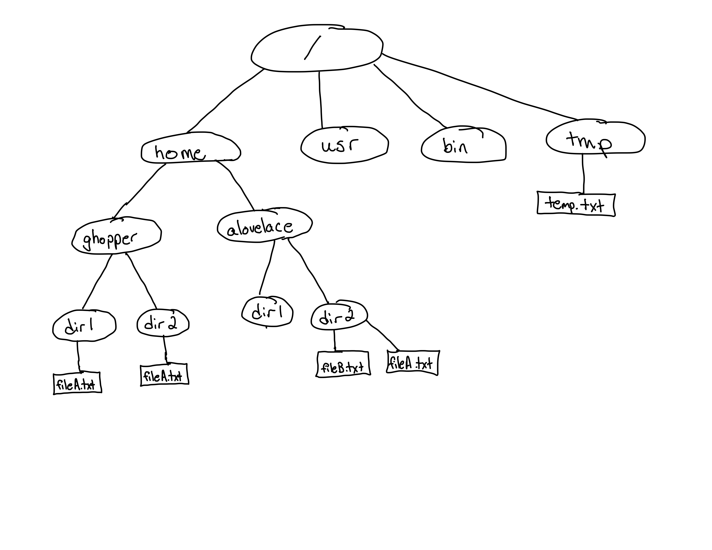

# Minilab 1

The purpose of this minilab is to see if basic
command line filesystem navigation commands make
sense.

Consider the following diagram representing a filesystem:

Suppose you are ghopper.  

## Question 1
Write the full absolute path to your home directory.
    

## Question 2
Suppose you are in your home directory.
Write the command to change into the `tmp` directory
using only absolute paths.
    

## Question 3
Suppose you are in your home directory.
Write the command to change into the `tmp` directory
using only relative paths.
    

## Question 4
Suppose you are in the `/usr` directory.

Write the command to copy fileA.txt from your `dir2`
directory to the tmp directory, without chanigng directories.
     
  

## Question 5
Suppose you are in the root directory.  Write
the command to remove your `dir1` directory.
Try doing this with absolute paths, then again
with relative paths.
     
  

## Question 6
Suppose you are in `/home/alovelace/dir1` (but you are
still `ghopper`).  Write a command to rename your
(ghopper's) `dir2` directory to `new`,
without changing directories.
Try doing this with both absolute paths and with relative paths.
     

