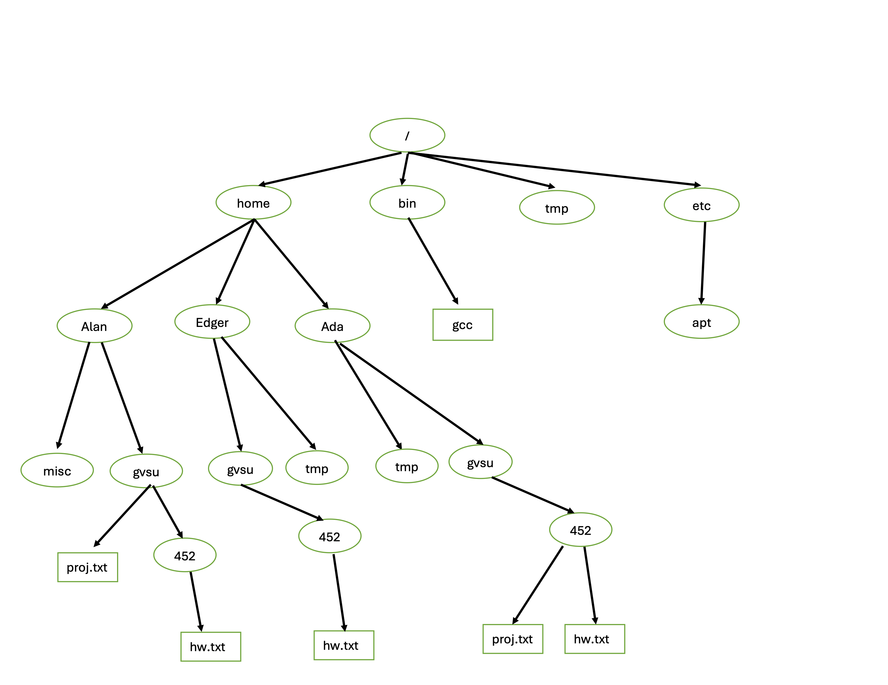

# Minilab - Review

The purpose of this minilab is to review some basics
for the first test.

Consider the following diagram representing a filesystem:



Suppose you are Alan.  

## Question 1
Suppose you are in your home directory and
run the following commands.
Write the full absolute path to the directory
you are in after running all of these commands.

```
cd /etc
cp /bin/gcc .
cd ..
cp ~/gvsu/452/hw.txt ~/hw.txt
```
<br><br><br><br>


## Question 2
Suppose you are in `~/gvsu`.
Write the command to change into `/etc/apt` directory
using only relative paths.
<br><br><br><br>


## Question 3
Suppose you are in `/bin`.

Write the command to copy `hw.txt` from Edger's 452 directory to EOS,
putting it in a directory named `cis452` on EOS in your home directory
with the name `edgerhw.txt`.
You may assume you have all the permissions you need to do this
and that `cis452` directory on EOS already exists.
Do this with a single command (e.g. without changing directories).
<br><br><br><br><br>
<br><br>

## Question 4
Suppose you are in the root directory.
Write the command to set the file permissions on your `proj.txt`
file such that you have read and write permissions,
the group associated with the file has read permissions,
and everyone else has no permissions.
<br><br><br><br><br>
<br><br>

## Question 5
Give one example of when you would use `more` over `cat`
<br><br><br><br>
